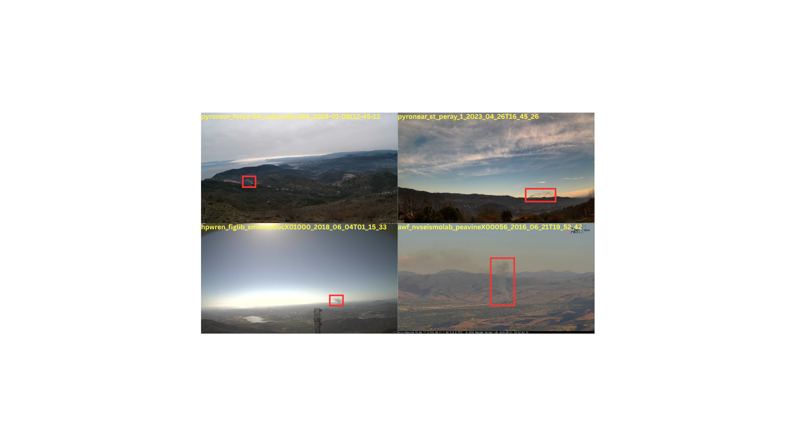
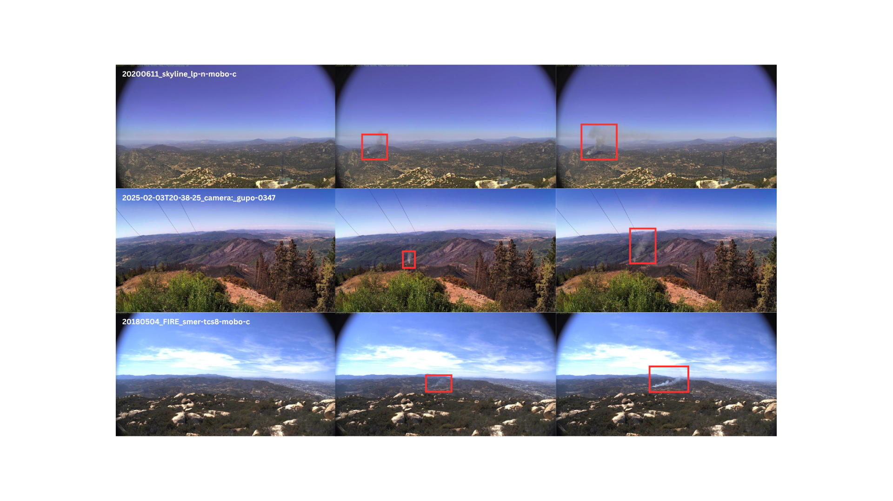

# Scraping The Web For Early Wildfire Detection

This repository accompanies the paper **“Scraping The Web For Early Wildfire Detection: A New Annotated Dataset of Images and Videos of Smoke Plumes In-the-wild”**. It provides the code to train and evaluate smoke detection models on still images and video sequences.

## Repository Layout

- **src/images** – YOLO-based single-frame detector. Contains training and evaluation scripts for the one-frame approach.  
- **src/videos** – CNN-LSTM sequential detector. Includes tools to train and evaluate temporal models.

Each folder includes its own `README.md` with detailed usage instructions.

## Sample Data

### Static Image Sample

---

### Video Frame Sample

> **Note:**  
> - `samples/images/` contains a small sub‐sample of the images.  
> - `samples/videos/` contains a small sub‐sample of the videos.  

## Full Dataset Access

Reviewers may request full access by contacting the authors via the conference submission system. Upon verification, we will provide a private download link.

---
